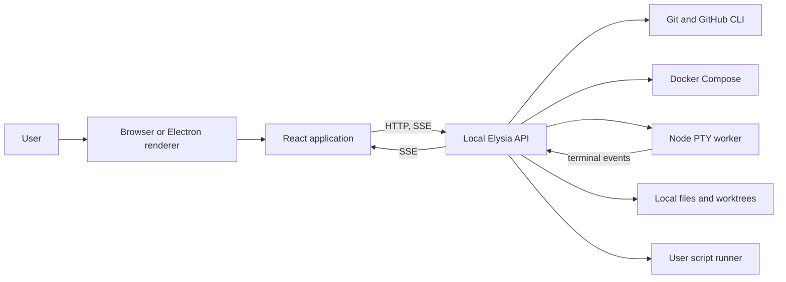
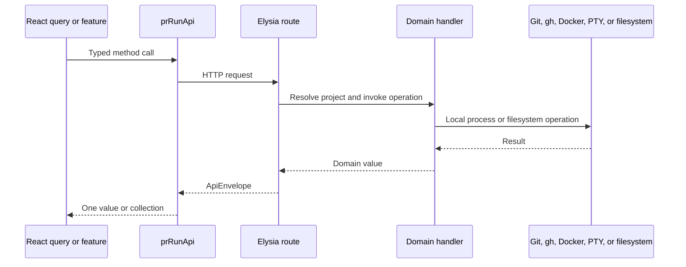
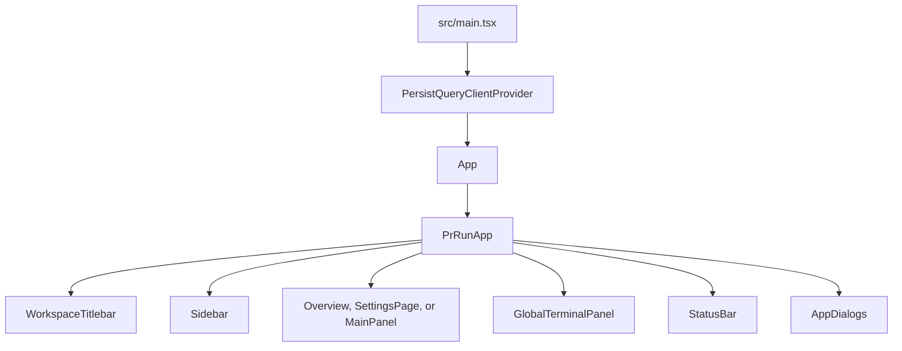

# Architecture

This document describes the current PR Run architecture. It covers the browser,
Electron, backend, and React execution paths as they exist today. The approved
full-stack Effect integration is documented in
[effect-migration.md](./effect-migration.md), and current structural problems
are tracked in [code-quality.md](./code-quality.md).

## System context

PR Run is a local-first application for inspecting pull requests and Git
branches, creating Git worktrees, preparing environment files, controlling
Docker Compose, running user-defined scripts, and keeping interactive terminal
sessions alive while the user moves through the UI.

The application has three runtime surfaces:

- A React renderer built by Vite.
- A local Elysia HTTP backend running on Bun.
- An optional Electron shell that starts the backend and hosts the renderer.

The packaged CLI is a fourth entry point, but not a separate application
layer. It starts the same Elysia backend in-process, serves the compiled React
assets, and opens the browser.



## Runtime modes

### Browser CLI

`bin/pr-run.cjs` verifies that Bun exists and starts `src/cli/pr-run.ts`. The
CLI:

1. Chooses available backend and UI ports.
2. Starts `createBackendApp()` in the CLI process.
3. Serves `dist/` through `Bun.serve`.
4. Adds the backend URL to the UI URL as the `api` query parameter.
5. Opens the default browser unless `--no-open` is set.

The CLI assigns an operating-system-specific user data directory when
`PR_RUN_USER_DATA_DIR` is not already set.

### Standalone development services

The Vite renderer and Bun backend run as separate processes. The renderer
resolves the backend URL in this order:

1. The Electron preload bridge, when present.
2. `api` or `backendUrl` from the page query string.
3. `VITE_PR_RUN_BACKEND_URL`.
4. The last query-provided URL saved in local storage.
5. `http://127.0.0.1:33134`.

The development server is an external workspace service and is not started by
normal repository maintenance tasks.

### Electron

`electron/main.ts` either uses `ELECTRON_BACKEND_URL` or starts
`src/backend/server.ts` as a Bun child process on an available loopback port.
The preload bridge exposes the resolved URL, platform information, and title
bar controls to the renderer. The React data path still uses the HTTP API.

Electron also contains an older terminal IPC path through
`TerminalSessionManager`. The current renderer does not use that path; its
terminal requests go through the backend HTTP and SSE endpoints. This is
documented as quality debt rather than part of the primary architecture.

## Backend architecture

### Request flow



`src/backend/http/app.ts` creates the Elysia application, configures CORS and
request logging, and translates `ApiError` instances into error envelopes.
`src/backend/routes.ts` is the HTTP controller and maps endpoints to handlers.

Every normal JSON response uses `ApiEnvelope<T>`:

```ts
type ApiEnvelope<T> = {
    type: "success" | "error";
    message: string;
    data: T[];
    _metadata: Record<string, string | number | boolean | undefined>;
};
```

Single-value client methods read `data[0]`; collection methods return the full
array. Streaming scripts and terminal events are the exceptions to the normal
JSON envelope.

### HTTP endpoint families

| Family                                                 | Responsibility                                                | Primary handler               |
| ------------------------------------------------------ | ------------------------------------------------------------- | ----------------------------- |
| `/health`                                              | Process readiness                                             | Route inline                  |
| `/config`, `/projects`                                 | Project registration and lookup                               | `projectConfigHandler`        |
| `/overview`                                            | Aggregated project and pull request summary                   | `gitHandler`                  |
| `/projects/:id/branches`                               | Local branches, remote branches, pull requests, and worktrees | `gitHandler`                  |
| `/projects/:id/checkout`, `/update`, `/worktree`       | Worktree lifecycle                                            | `gitHandler`                  |
| `/projects/:id/commits`, `/diff`, `/file`, `/activity` | History, changes, file content, and review activity           | `gitHandler`                  |
| `/projects/:id/pull-requests/...`                      | GitHub comments and reviews                                   | `gitHandler`                  |
| `/projects/:id/docker...`                              | Compose discovery, status, and terminal commands              | `dockerHandler`               |
| `/projects/:id/env`                                    | Shared environment-file discovery and linking                 | `envFilesHandler`             |
| `/scripts...`, `/projects/:id/scripts...`              | Script CRUD, inspection, execution, and streams               | `scriptsHandler`              |
| `/projects/:id/package-scripts...`                     | Workspace package script discovery and commands               | `scriptsHandler`              |
| `/terminal/sessions...`                                | PTY lifecycle, input, resize, state, and SSE                  | `terminalHandler`             |
| `/ssh-passphrase...`                                   | In-memory SSH passphrase lifecycle                            | Module-level credential store |
| `/github/media`                                        | Validated GitHub attachment proxy                             | `gitHandler`                  |

### Handler domains

The backend keeps OS-facing logic under `src/backend/handlers`:

- `git/` wraps Git and GitHub CLI operations. Its public facade is
  `gitHandler`; parsing and GitHub normalization functions remain in focused
  modules with unit tests.
- `docker/` locates Compose files, selects an available Compose CLI, reads
  service state, and prepares shell-safe terminal commands.
- `env-files.ts` links root environment files into worktrees and returns their
  contents and link metadata.
- `scripts/` stores global TypeScript scripts, loads their registration
  metadata in a child process, discovers package scripts, and either executes
  them or prepares commands for a user terminal.
- `terminal/` owns the HTTP terminal protocol and delegates `node-pty` work to
  `pty-worker.cjs` over newline-delimited JSON.
- `external-launcher.ts` opens files and locations in an editor or operating
  system application.
- `config-store.ts` persists registered project groups as JSON.

Handlers convert tool failures into `ApiError` values with a stable code,
human-facing message, HTTP status, optional details, and optional action
metadata. SSH failures use the metadata action `prompt_ssh_passphrase` so the
renderer can pause and retry the feature that initiated the request.

### Terminal flow

The HTTP backend is the owner of terminal sessions:

1. `terminalHandler` starts one Node worker lazily.
2. Requests are assigned UUIDs and sent to the worker as JSON lines.
3. The worker owns `node-pty` processes and buffered output.
4. Responses are matched to pending requests by UUID.
5. Output and exit events are published to per-session subscribers.
6. The renderer consumes `EventSource` through a scoped Effect Stream.
7. TanStack Query owns terminal snapshots and lifecycle mutations, Zustand owns
   terminal tabs and layout, and the Xterm hook owns the imperative terminal.

The separate worker prevents `node-pty` lifecycle failures from being mixed
directly into the Bun HTTP process and gives the backend one place to dispose
all sessions during shutdown.

### Script flow

Scripts are trusted local TypeScript stored under `<user-data>/scripts`.
Creating a script generates a slug plus UUID filename and a registration
template. Loading or validating a script happens in a Bun child process so the
script can register metadata through the runtime API. Execution can stream
marked result and event lines back to the HTTP response, or produce a command
that the renderer writes into an interactive worktree terminal.

Scripts run with the user's operating-system permissions and inherited
environment. They are an intentional local-code execution boundary.

### Persistence and filesystem layout

| Data                         | Location                                | Owner                      |
| ---------------------------- | --------------------------------------- | -------------------------- |
| Registered project groups    | `<user-data>/projects.json`             | Effect `ProjectRepository` |
| User scripts                 | `<user-data>/scripts/*.ts`              | Scripts handler            |
| Worktrees                    | `<project>/.pr-run/<normalized-branch>` | Git handler                |
| Shared `.env*` files         | Project root, symlinked into worktrees  | Env-files handler          |
| SSH passphrase               | Backend process memory only             | SSH passphrase module      |
| Query snapshots              | Browser IndexedDB                       | TanStack Query persister   |
| UI preferences and open tabs | Browser local storage                   | Zustand stores             |

When no user data directory is provided to the standalone backend, it falls
back to `.pr-run-data` under the current working directory.

## Frontend architecture

### Application composition

`src/main.tsx` creates the React root and installs a persisted TanStack Query
provider, crash boundary, application root, and toast viewport.



`PrRunApp` is the feature composition boundary. `usePrRunAppState` composes
configuration queries, mutations, navigation state, preferences, terminal
status, dialogs, and user-visible errors. The main workspace then selects one
of three views:

- Overview for all projects or one project.
- Settings for application preferences and project/script management.
- Main panel for a selected branch, with Activity, Changes, and Run tabs.

The component directory follows four practical layers:

- `ui/`: low-level controls adapted from the component library.
- `atoms/`: small PR Run visual primitives.
- `molecules/`: reusable stateful units such as markdown and terminals.
- `templates/`: page- and feature-specific composition.

### Server state

All ordinary remote reads and writes use TanStack Query hooks under
`src/lib/hooks/query`.

- `prRunQueryKeys` defines stable keys by domain, project, branch, and base.
- Query hooks call the central `prRunApi` client.
- Mutation hooks own cache invalidation.
- Selected safe queries are persisted to IndexedDB for 24 hours.
- Persisted data is shown immediately and refreshed in the background.

Configuration, scripts, overview snapshots, branch inventories, package
scripts, commit history, diffs, and activity can be persisted. Secrets,
terminal state, script source, environment-file contents, and unknown query
families are intentionally excluded.

Terminal session snapshots and lifecycle writes also use TanStack Query but
are intentionally excluded from persistence. Their HTTP operations execute
through the shared Effect-backed Ky client.

### Client state

| Domain                                                  | Owner                                      | Persistence              |
| ------------------------------------------------------- | ------------------------------------------ | ------------------------ |
| Theme, date format, hotkeys, sidebar and terminal sizes | `useUiPreferencesStore`                    | Local storage            |
| Open worktree tabs and active tab                       | `useWorkspaceTabsStore`                    | Local storage            |
| Package-script favorites                                | `usePackageScriptFavoritesStore`           | Local storage            |
| Terminal tabs, labels, selection, and panel ownership   | `useWorktreeTerminalStore`                 | Process memory           |
| SSH prompt, passphrase input, and retry actions         | `useSshPassphraseStore`                    | Process memory           |
| Selected route and overview state                       | `useWorkspaceState` and `useSettingsState` | URL plus component state |
| Small dialogs, menus, searches, and draft interactions  | Owning component                           | Process memory           |

Derived status such as busy projects and terminals is calculated from the
terminal store rather than persisted independently.

### API client and SSH retry

`src/lib/api/` is the renderer's HTTP boundary. Its folder entry point composes
domain clients for projects, Git, reviews, scripts, environment operations, and
terminals. `transport.ts` owns backend URL discovery, response envelopes, SSH
interception, and the Ky service. Ky is provided through a managed Effect
runtime, so every HTTP request enters a named Effect program while TanStack
Query remains the cache and mutation owner.

The Ky response hook recognizes SSH authentication errors. It clears any
cached passphrase, captures the failed request, and opens the SSH dialog. A
feature may also register a semantic retry action, such as checkout or
worktree refresh. Saving the passphrase retries those actions and closes the
dialog only after success.

### Navigation

PR Run uses a small History API adapter instead of a routing library. Routes
represent overview, project overview, settings sections, and branch subpages.
Worktree tabs are persisted separately and reconciled against fresh branch
inventories during startup.

## Dependency direction

The intended dependency direction is:

```text
React templates -> query/feature hooks -> domain API modules -> Effect/Ky transport
Effect/Ky transport -> Elysia routes -> backend handlers and Effect services
React visual children -> explicit props
Handlers -> shared contracts and local OS integrations
```

Backend handlers do not import renderer modules. Presentational React children
should not import API clients or application stores. Current exceptions and
boundary drift are listed in the quality audit.

## Approved target

PR Run will integrate Effect across the backend and frontend without replacing
the specialized libraries already in use. Backend operations become services
supplied by layers, while processes and streams become scoped resources.
Elysia remains the HTTP server, Ky remains the browser transport, TanStack Query
continues to own remote React state, and focused Zustand stores continue to own
shared synchronous UI state. Effect programs provide the typed workflows below
those adapters.

The first integration slice is implemented: asynchronous handler facades enter
named Effect programs, project configuration uses a serialized and atomic
Effect repository with a shared runtime schema, browser HTTP uses a Ky-backed
Effect service, and terminal SSE uses a scoped Effect Stream without moving UI
state out of Zustand or remote state out of TanStack Query.

The remaining migration removes the duplicate Electron terminal stack and
gives the URL one discriminated navigation state. See the
[Effect integration architecture](./effect-migration.md) for package boundaries,
frontend ownership, sequencing, and completion criteria.

## Verification

Use Bun for all repository commands:

```bash
bun test
bun run typecheck
bunx prettier --write <changed-files>
```

Do not start the development server as part of verification; it is managed
outside the task workflow.
