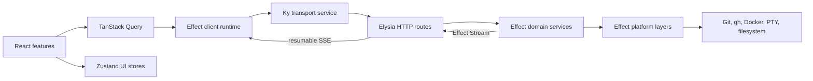

# Effect integration target architecture

This document defines how PR Run will adopt Effect across the backend, browser
renderer, Electron shell, and CLI while retaining the libraries that already
solve specialized problems well. The current system is documented in
[architecture.md](./architecture.md).

## Architecture decision

Effect complements the existing stack; it does not replace it wholesale.

| Concern                                       | Owner                                  |
| --------------------------------------------- | -------------------------------------- |
| Backend routing, HTTP lifecycle, and CORS     | Elysia                                 |
| Browser HTTP transport                        | Ky                                     |
| Remote React state, caching, and invalidation | TanStack Query                         |
| Shared synchronous UI state and preferences   | Focused Zustand stores                 |
| Local rendering and interaction state         | React                                  |
| Domain workflows and typed failures           | Effect                                 |
| Dependency injection and implementations      | Effect services and layers             |
| Processes, subscriptions, and cleanup         | Effect scopes                          |
| Queues, concurrency, retries, and streams     | Effect                                 |
| Runtime data contracts                        | Shared schemas, favoring Effect Schema |

The phrase "migrate everything to Effect" therefore means that asynchronous
domain work is represented as Effect programs before it crosses an adapter. It
does not mean rebuilding TanStack Query's cache, Zustand's UI stores, Ky's HTTP
driver, or Elysia's router with more generic primitives.

This distinction avoids two failure modes:

- using Effect only as a renamed `Promise`, without gaining typed errors,
  scopes, layers, or concurrency control;
- forcing Effect to own React cache and UI responsibilities already handled by
  focused libraries.

## Design sources

The design adapts useful T3 Code patterns:

- one schema-first contracts package;
- one shared client runtime instead of HTTP logic in components;
- services and layers for runtime capabilities;
- explicit concurrency policies for commands;
- scoped connection and process lifetimes;
- one connection/retry owner;
- ordered streams with observable decode and gap failures;
- explicit package subpath exports rather than broad root barrels.

PR Run deliberately does not copy T3 Code's Effect Atom state architecture,
remote relay, provider abstraction, or WebSocket topology. TanStack Query and
Zustand remain PR Run's frontend state owners, and authenticated HTTP plus
resumable SSE remains the smaller local transport.

## Target system



There is one business architecture in every runtime mode:

- Browser CLI starts the Elysia backend and static-file server inside one
  scoped Effect program.
- Development runs the same backend layer independently from Vite.
- Electron starts the same backend program as a child and exposes only backend
  bootstrap data and window operations through preload.
- The renderer always uses the Ky-backed client runtime. Electron does not own
  a second terminal protocol.

## Package boundaries

The migration can begin in the current package. Bun workspaces are an optional
later organization step, not a prerequisite and not part of the first
cutover.

```text
src/
├── contracts/                 # Shared schemas, values, requests, and errors
├── backend/
│   ├── http/                  # Elysia routes and Effect runtime adapter
│   ├── services/              # Effect domain service interfaces
│   ├── layers/                # Bun and operating-system implementations
│   └── programs/              # Use-case composition
├── lib/
│   ├── client-runtime/        # Effect runtime and Ky service
│   ├── hooks/query/           # TanStack Query adapters
│   └── hooks/store/           # Focused Zustand UI domains
├── cli/                       # Scoped CLI entry point
└── electron/                  # Electron bootstrap and window integration
```

If the package boundaries become stable and independent builds are valuable,
move them to Bun workspaces:

```text
apps/web
apps/server
apps/desktop
apps/cli
packages/contracts
packages/domain
packages/client-runtime
packages/platform-bun
packages/test-layers
```

The dependency direction is the same in either layout:

```text
React features -> TanStack hooks -> client runtime -> Ky -> Elysia routes
Elysia routes -> Effect programs -> Effect services -> platform layers
Zustand stores -> synchronous client state and browser persistence only
All layers -> shared contracts
```

Contracts must not import React, Elysia, Ky, Electron, Bun implementations, or
client runtime code. Domain services must not import HTTP routes or React.
Visual components must not import Ky, Elysia, or backend packages.

## Contracts and HTTP boundary

### Shared contracts

Move transport-safe models currently duplicated in
`src/backend/types.ts`, `src/types/pr-run.ts`, and `electron/types.ts` into one
contracts directory. Define request inputs, responses, persistent documents,
and expected failures with runtime schemas.

Effect Schema is the preferred contract source for values that participate in
Effect programs because it provides decoding and typed tagged errors. Existing
Zod schemas do not need to be mechanically deleted. Zod can remain for a
focused form or integration when it is the better adapter. The rule is one
authoritative schema per value, not one validation library everywhere.

Use tagged domain errors rather than a generic message-only error:

```ts
class ProjectNotFound extends Schema.TaggedErrorClass<ProjectNotFound>()(
    "ProjectNotFound",
    {
        projectId: Schema.String,
    },
) {}
```

Elysia maps declared errors to stable HTTP responses. Defects remain internal,
receive a trace identifier, and become a sanitized `InternalServerError`.
Secrets such as SSH passphrases must use redacted values and must never appear
in spans or logs.

The current `ApiEnvelope<T>` should eventually be replaced with endpoint-
specific success and error schemas. Collection and single-value responses
should not differ through a `data[0]` client convention.

### Elysia as the server adapter

Elysia remains responsible for:

- route matching and parameters;
- server startup and shutdown integration;
- CORS and capability-token middleware;
- HTTP status, headers, and streaming responses;
- translating between HTTP values and typed domain exits.

Create one managed Effect runtime when the backend starts. Routes decode their
input, build a domain program, and run it through that runtime. They must not
construct a layer or runtime per request.

Conceptually:

```ts
app.post("/projects", ({ body, status }) =>
    backendRuntime
        .runPromiseExit(projectPrograms.add(body))
        .then((exit) => httpResponse.fromExit(exit, status)),
);
```

Business behavior, retries, command execution, and filesystem work do not
belong in Elysia handlers.

Every backend process creates an unguessable capability token. The browser URL
or Electron preload supplies it to the Ky service, and every HTTP and SSE
request presents it. CORS permits only active renderer origins. Non-loopback
binding requires an explicit secure remote mode.

### Ky as the browser transport service

Ky remains the low-level HTTP driver. Provide it through an Effect service so
domain client programs depend on a typed capability rather than a global
singleton.

The Ky layer owns:

- backend URL and capability-token headers;
- timeouts and safe retry policy for idempotent requests;
- response decoding;
- HTTP-to-domain error translation;
- cancellation through the Effect interruption signal;
- transport tracing.

It must not open dialogs, update Zustand, invalidate queries, or keep executable
retry callbacks. Those decisions belong to the feature boundary.

## Backend Effect architecture

### Services

Define small service interfaces around capabilities and domains. Live layers
call the operating system; tests provide in-memory or scripted layers.

| Service             | Responsibility                                                   |
| ------------------- | ---------------------------------------------------------------- |
| `AppConfig`         | Decode environment and runtime bootstrap configuration           |
| `ProjectRepository` | Read and atomically update registered project configuration      |
| `Git`               | Git commands, worktrees, commits, diffs, and branch inventory    |
| `GitHub`            | `gh` operations, media, pull request comments, and reviews       |
| `DockerCompose`     | Compose discovery, status, and command preparation               |
| `EnvironmentFiles`  | Discover and link shared environment files                       |
| `ScriptRepository`  | Script CRUD and registration metadata                            |
| `ScriptRunner`      | Scoped inspection and execution streams                          |
| `TerminalSessions`  | Scoped PTY sessions, input, resize, snapshots, and event streams |
| `ExternalLauncher`  | Open editors, files, directories, and URLs                       |
| `SshCredentials`    | In-memory redacted credential lifecycle                          |
| `StreamJournal`     | Ordered event publication and bounded replay                     |

Command execution, filesystem access, clock, UUID generation, and logging are
platform dependencies. Domain services should not call `Bun.spawn`, `fetch`,
`fs`, `Date.now`, or `crypto.randomUUID` directly.

### Layer composition

Compose one application layer at each executable boundary:

```text
PlatformBunLive
    -> AppConfigLive
    -> repositories
    -> Git/GitHub/Docker/Script/Terminal services
    -> backend Effect runtime
    -> Elysia adapter
```

The CLI, standalone server, and Electron child use the same domain services and
Elysia application and differ only in bootstrap configuration and shutdown
signals. Close the root scope on `SIGINT`, `SIGTERM`, Electron shutdown, or test
completion.

### Resources, queues, and concurrency

Use `Effect.acquireRelease` and `Scope` for:

- the Elysia listener;
- the terminal worker and each PTY session;
- child processes used to inspect or run scripts;
- SSE subscribers;
- temporary files;
- Electron's backend child process.

Serialize `projects.json` changes through a queue and write a temporary file
followed by atomic rename. Git mutations are keyed by project/worktree so two
destructive operations cannot race on one repository while unrelated projects
can proceed concurrently.

Terminal input is serial per session. Resize is latest-wins per session. Open,
close, and restart are serial per terminal owner. Checkout and worktree
mutations are single-flight per project and branch.

Expected command failures enter a tagged error channel. Logging happens at the
boundary that has operation, project, duration, exit code, and safe command
metadata. `Cause` is retained for defects and interruption.

## Frontend architecture

### Root composition

`src/main.tsx` keeps the persisted TanStack Query provider. It also creates one
client Effect runtime containing the Ky transport layer, runtime bootstrap,
browser connectivity, safe logging, and tracing.

Do not create an Effect runtime, Ky instance, transport client, or retry loop
inside a component or query function. Query hooks receive the shared runtime
through a focused module or provider. Tests replace its layers explicitly.

### State ownership

The completed architecture retains the repository's state classification:

| State kind                         | Owner                                       |
| ---------------------------------- | ------------------------------------------- |
| Remote snapshots and command state | TanStack Query                              |
| Shared synchronous UI state        | Focused Zustand store                       |
| Persistent preferences             | Focused persisted Zustand store             |
| Local visual interaction           | React `useState`                            |
| Derived state                      | Query selectors, store selectors, or render |
| Async workflows and resources      | Effect programs and scopes                  |

Never copy query data, mutation errors, pending state, or mutation variables
into Zustand or `useState`. Zustand stores must not call the client runtime or
Ky. Effect services must not import React hooks or Zustand stores.

Effect does not improve a tooltip's open flag, an uncontrolled input, or a
one-component draft. Those remain React state. It also does not replace a query
cache or a focused synchronous store.

### TanStack Query adapters

Query and mutation hooks remain under `src/lib/hooks/query`. Their functions
run typed Effect client programs and convert their typed failures into errors
TanStack Query can expose to React.

```ts
export function useProjectBranchesQuery(projectId: string) {
    const client = usePrRunClient();

    return useQuery({
        queryKey: prRunQueryKeys.branches(projectId),
        queryFn: ({ signal }) =>
            client.runPromise(projectClient.listBranches(projectId), {
                signal,
            }),
    });
}
```

TanStack Query continues to own:

- query identities and deduplication;
- stale time and background refresh;
- safe IndexedDB persistence;
- mutation pending variables and failures;
- cache invalidation after mutations;
- cancellation initiated by React lifecycle.

Effect owns the operation below the hook:

- typed transport and domain failures;
- dependency access;
- retry and timeout policy that is not cache policy;
- spans and safe logging;
- scoped subprocess or subscription lifetimes;
- concurrency across multi-step workflows.

Avoid retrying the same failure independently in Ky, Effect, and TanStack
Query. Assign one retry owner per failure category: Ky for safe transient
transport retries, Effect for multi-step domain recovery, and TanStack Query
for user-visible refetch policy.

### Zustand domains

Keep one store per synchronous client domain:

```text
use-ui-preferences-store
use-workspace-tabs-store
use-package-script-favorites-store
use-terminal-layout-store
use-dialog-store
```

Stores expose narrow semantic actions and selectors. They may use versioned,
schema-validated browser persistence. They must not contain remote snapshots,
Effect runtimes, promises, API clients, query results, or executable retry
callbacks.

`useWorktreeTerminalStore` must be split because its current problem is mixed
ownership, not Zustand itself. TanStack Query owns terminal session snapshots
and lifecycle mutations. A focused Zustand store may own terminal tabs,
selection, panel layout, and labels.

### Navigation

Use one discriminated route value as the navigation source:

```ts
type AppRoute =
    | { type: "overview"; projectId?: string }
    | { type: "settings"; section: SettingsSection }
    | {
          type: "branch";
          projectId: string;
          branchId: string;
          page: "activity" | "changes" | "run";
      };
```

The URL serializes this value. Selected branch, overview visibility, and active
page are derived rather than synchronized separately. Open tabs remain a
focused persistent Zustand domain; navigating to a tab is one semantic action.
A routing library is optional and independent from Effect adoption.

### Persistence

Keep the TanStack Query persister for explicitly safe remote snapshots and
Zustand persistence for preferences, favorites, and open tabs. Add a runtime
schema, version, and migration to each stored document.

Terminal state, passphrases, environment-file contents, script source, mutation
failures, and unknown query families are never persisted. Separate storage
keys ensure one invalid document cannot reset unrelated domains.

### Streams and terminal UI

Terminal and script output are Effect Streams beneath their frontend feature
adapters. Events use a shared ordered schema:

```ts
type StreamEvent<A> = {
    streamId: string;
    sequence: number;
    emittedAt: string;
    payload: A;
};
```

Each stream increments `sequence` monotonically and keeps a bounded replay
buffer. Reconnect sends the last observed sequence. The server replays the gap
or returns a typed `StreamGap` that forces a snapshot query refresh.

The terminal feature divides ownership as follows:

- TanStack Query owns session snapshots and open/close/restart mutations.
- Effect Stream owns SSE decoding, reconnection, interruption, and finalizers.
- Zustand owns terminal tabs, labels, selection, and panel layout.
- The React hook owns the imperative Xterm instance and writes streamed output.

Moving between tabs must not close a backend terminal unless its owner is
explicitly closed. No Zustand store calls the API, and Electron has no parallel
terminal manager.

### SSH authentication

Ky middleware translates the response into a tagged
`SshAuthenticationRequired` failure but does not open UI or store retry
callbacks. TanStack Query retains the mutation variables. The feature opens a
small dialog through a Zustand semantic action, submits the passphrase through
a mutation, and retries the original typed mutation explicitly. The secret
input itself stays local React state and is cleared after every settled attempt.

### React component boundaries

The integration is also a component architecture improvement:

- `PrRunApp` renders the application frame and route outlet; it does not return
  or consume one flattened controller object.
- Feature roots read their focused query hooks and Zustand selectors.
- Presentational children receive explicit domain values and callbacks.
- `main-panel`, `sidebar-project-item`, `branch-page-header`, and `run` are
  split by feature responsibility, not only line count.
- React effects are reserved for browser or imperative resource
  synchronization. Derived values are calculated rather than synchronized.
- Components never import Ky, create Effect runtimes, or control backend
  resource lifetimes.

## Observability and testing

Attach spans to HTTP requests, Effect programs, Git/GitHub/Docker calls,
terminal lifecycle changes, and script runs. Include safe project and operation
identifiers, duration, outcome tag, retry count, and stream sequence. Never log
passphrases, environment values, terminal input, or script source.

Use deterministic test layers for filesystem, command execution, clock, UUID,
GitHub, Docker, and terminals. Required test levels are:

- schema round-trip and rejection tests;
- Effect service tests using fake layers and test clocks;
- Elysia contract tests for success, declared failures, auth, and invalid input;
- Ky client tests for decoding, authentication, cancellation, and error mapping;
- TanStack Query hook tests for cache policy and invalidation;
- Zustand tests for semantic actions and persistence migrations;
- stream tests for reconnect, replay, gaps, interruption, and finalization;
- browser CLI and Electron smoke tests using the same HTTP terminal path.

Queue-backed workers expose a drain/test-idle capability. Tests must not depend
on arbitrary sleeps.

## Migration sequence

Use vertical slices. A slice is complete only when its contract, backend
program, Elysia endpoint, Effect client operation, TanStack hook, consumers,
and tests have moved. Do not create a generic compatibility controller that
becomes another permanent architecture.

### Implemented foundation

The initial vertical foundation is complete:

- one managed backend Effect runtime wraps every asynchronous domain facade;
- the first shared Effect Schema owns project configuration types in both
  backend and renderer builds and validates persisted JSON;
- project configuration is an Effect service with serialized mutations and
  atomic temporary-file replacement;
- one Ky-backed Effect service executes browser HTTP requests;
- TanStack Query owns terminal snapshots and session mutations;
- the terminal Zustand store contains only synchronous UI/domain state;
- terminal SSE is an Effect Stream with a scoped `EventSource` finalizer;
- backend and CLI shutdown dispose the managed backend runtime;
- concurrency regression tests cover simultaneous project additions.

The remaining phases below continue replacing promise implementations inside
the facades with typed services and shared schemas. Elysia, Ky, TanStack Query,
and Zustand remain in their assigned roles throughout.

### Phase 0: Guardrails

1. Align Effect and Effect platform test packages to compatible versions.
2. Create one contracts directory, backend runtime, and frontend client runtime.
3. Add characterization tests for HTTP responses, navigation, terminal
   survival, query persistence, and SSH retry.
4. Add architecture-boundary checks for stores, hooks, services, and adapters.
5. Amend `AGENTS.md`: migrated Effect modules use typed Effect errors;
   `tryPromise` remains the convention for unmigrated promise-based modules.

### Phase 1: Security and configuration

1. Migrate project/config contracts and tagged errors first.
2. Add capability-token authentication and strict CORS to Elysia.
3. Create `AppConfig` and `ProjectRepository` Effect services.
4. Serialize configuration writes and use atomic rename.
5. Introduce the Ky Effect service while preserving endpoint paths and query
   keys.

### Phase 2: Read-only vertical slices

Move projects, overview, branch inventory, commits, diffs, activity, Docker
status, environment-file metadata, and package scripts. Existing TanStack hooks
keep their public API while their query functions switch to Effect client
programs.

### Phase 3: Commands and frontend ownership

Move project changes, checkout/worktree operations, reviews, script CRUD, and
command preparation to typed Effect programs beneath TanStack mutations.
Consolidate navigation and split stores that mix remote and UI state. Refactor
the `PrRunApp` controller by feature boundary.

### Phase 4: Streams and terminals

Implement the ordered replay journal, migrate script output, then migrate
terminal sessions. Terminal is last because it combines child processes,
streaming, reconnection, query state, Zustand UI state, and imperative React
code. After browser and Electron smoke tests, remove Electron's terminal IPC
stack.

### Phase 5: Entry points and cleanup

1. Move server, CLI, and Electron resource lifecycles into Effect scopes while
   retaining Elysia as the HTTP server.
2. Delete duplicate contracts and legacy direct API calls.
3. Remove a dependency only when its responsibility no longer exists; do not
   remove Elysia, Ky, TanStack Query, or Zustand as an Effect migration goal.
4. Move to Bun workspaces only if the proven package boundaries justify it.
5. Record a new Fallow baseline and enforce architecture boundaries in CI.

The current migration slice has completed the shared project schema and
repository service, managed backend and client runtimes, the Effect-backed Ky
transport, terminal Query mutations and Effect stream, removal of the Electron
terminal duplicate, and split domain API modules. Elysia, Ky, TanStack Query,
and focused Zustand stores remain in their intended roles.

## Completion criteria

The integration is complete when:

- external input has one authoritative runtime schema;
- expected domain and transport failures are typed;
- backend capabilities are Effect services supplied by layers;
- processes, sessions, subscriptions, and servers have scoped finalizers;
- Elysia routes are thin adapters over domain programs;
- Ky is provided as the typed browser transport service;
- TanStack Query exclusively owns remote React state and mutations;
- focused Zustand stores exclusively own shared synchronous UI state;
- React retains local visual interaction state;
- no Zustand store or component calls Ky or the API directly;
- one terminal implementation works in browser and Electron modes;
- one route value owns navigation;
- retry ownership is explicit and not duplicated across layers;
- contract, service, route, client, query, store, stream, browser CLI, and
  Electron tests pass with Bun;
- Fallow reports no new cycles or boundary violations and materially lower
  duplication than the current baseline.
